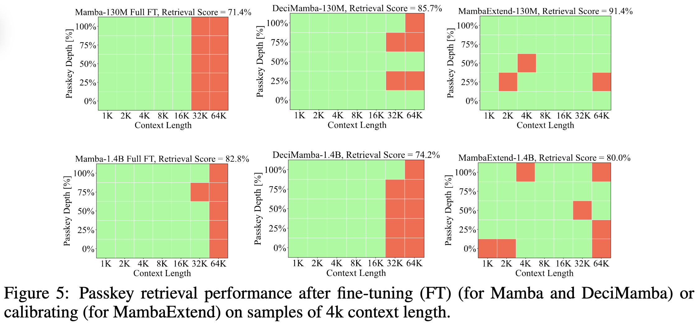

# Run MambaExtend on Passkey Retrieval
<pre> <code>python -u finetune_ssm.py </code> </pre>

**Note:** This code is based on the DeciMamba implementation for the passkey retrieval task. You can set the mambaextend arguement in the ./configs/ file to true in order to run mambaextened, or set if to false to run original mamba.

